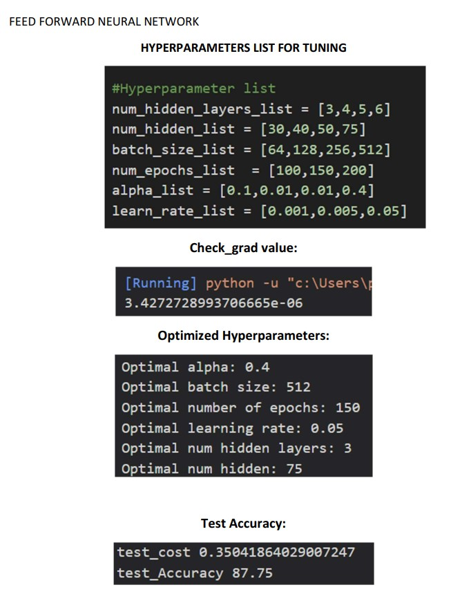
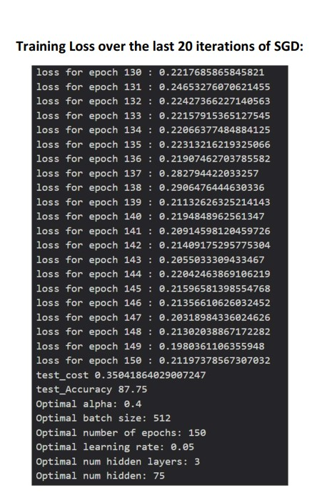
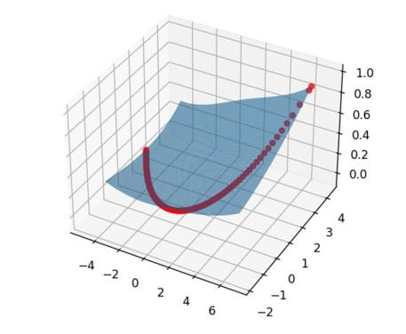

# Classification-for-Fashion-MNIST-from-Scratch

Trained Multi-layer neural network to classify images of fashion items from Fashion MNIST dataset from scratch.

Cross Entropy cost function is used for training with Stochastic gradient descent.

3D cross entopy loss as a function of neural network parameters (two directions) is plotted by using PCA.

Hyperparameter tuning is carried out on different hyperparameters on validation set:
1. Number of hidden layers
2. Number of units in each hidden layer
3. Learning Rate
4. Minibatch Size
5. Number of Epochs
6. L2 regularization strength

Training and evaluation file:
  'code.py'
  

